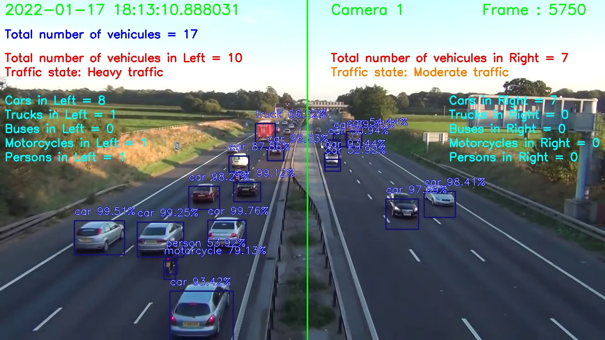

# Traffic Flow Analysis

Traffic Flow Analysis example using Azure ML and Yolo object detection.

Drones and cameras-based traffic flow tracking and prediction can be achieved using Computer Vision capabilities. These algorithms can now accurately track and count freeway traffic or monitor and analyse traffic density in urban areas, helping to design better traffic management systems and improve road safety.

In this example we can count the total number of vehicles and its categories (cars, trucks, buses, motorcycles...). We can define areas for the detection attributes (left lanes vs right lanes). Results are logged and saved into an Azure ML experiment.

  
This Python notebook will automatically download some images and video for the demo.
 
 
19-Jan-2022 
Serge Retkowsky | serge.retkowsky@microsoft.com | https://www.linkedin.com/in/serger/
